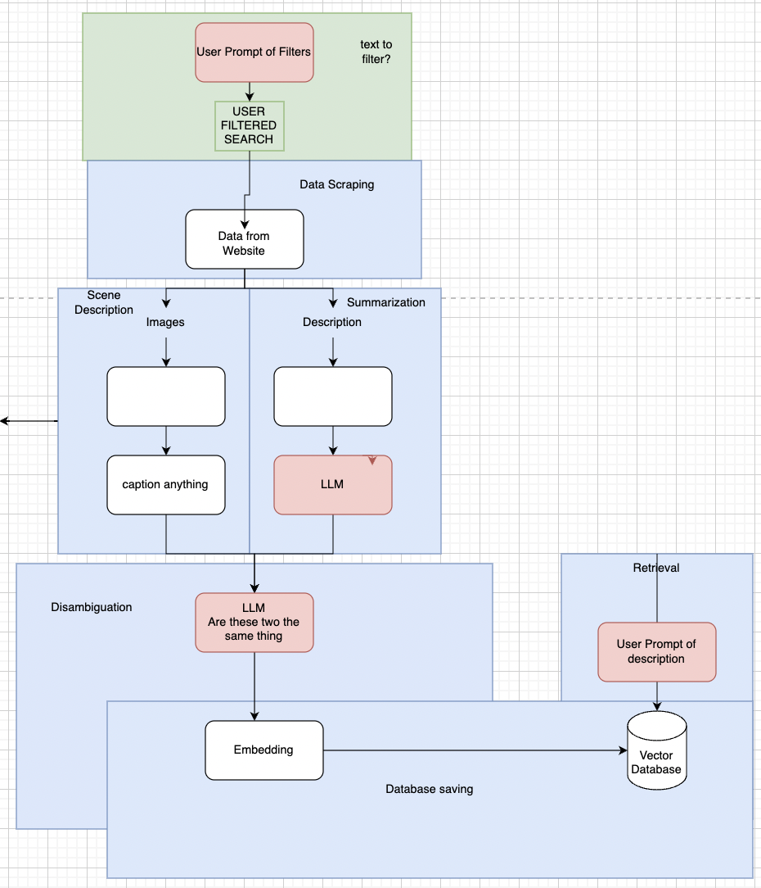

  

# bnbselect: Your Personal Agent for Airbnb 
### Introduction
TOO MANY CHOICES! Give me quality recomendations!

Have you ever had 200+ options on Airbnb even after you applied all your filters? 
What if someone could just go through all the descriptions, reviews, and images for you to narrow down the options to ones you might ACTUALLY be interested in? 

**bnbselect** is an autonomous agent who will narrow down airbnb options for you.
By entering your preferences, bnbselect will remember your information, scrape all the texts and the images, and curate a list of top matches just for you.

### How does it work?
Let's say you want to find a house in New York. Because you have children, you need a room with at least 3 beds. 
You also prefer rooms with free wifi, a good view, clean bathrooms, and a location close to the metro. 
These preferences will most likely not change, so bnbselect will remember these your personal preferences and provide you with the best k-matches every time your look for a room.
 
**bnbselect** utilizes **APIFY** to scrape Airbnb listings, **Blip-2** model to caption images, **GPT3.5** to process descriptions and reviews, **Pinecone** to store vector embeddings of the final review generated by our pipeline, and k-nearest neighbors to provide the top matches.  

  
